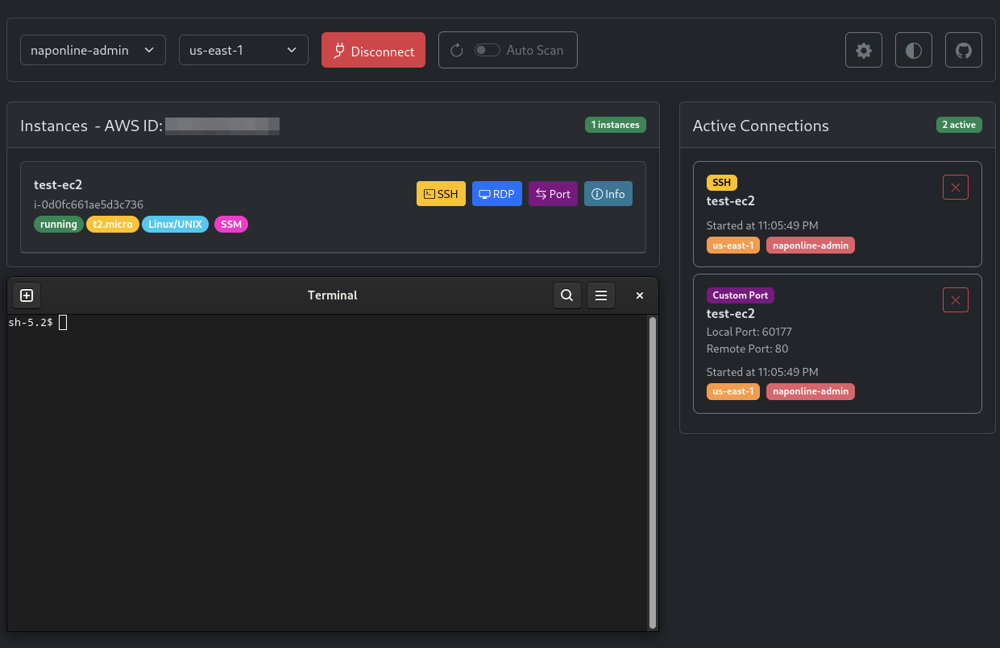

# SSM Manager

A desktop application for managing SSM session on AWS cloud with a user-friendly GUI interface.

[](https://github.com/napalm255/ssm-manager/releases)
[](https://github.com/napalm255/ssm-manager?tab=MIT-1-ov-file)
[](https://github.com/psf/black)
[](https://www.python.org/)
[&replace=%241&logo=bootstrap&logoColor=%237952B3&label=bootstrap&color=%237952B3)](https://getbootstrap.com/)
[&replace=%241&logo=vue.js&label=vue&color=%234FC08D)](https://vuejs.org/)
[](https://flask.palletsprojects.com/en/stable/)
[](https://boto3.amazonaws.com/v1/documentation/api/latest/index.html)
[](https://pydantic.dev/)
[](https://sonarcloud.io/summary/new_code?id=napalm255_ssm-manager)
[](https://sonarcloud.io/summary/new_code?id=napalm255_ssm-manager)
[](https://sonarcloud.io/summary/new_code?id=napalm255_ssm-manager)
[](https://sonarcloud.io/summary/new_code?id=napalm255_ssm-manager)
[](https://sonarcloud.io/summary/new_code?id=napalm255_ssm-manager)
[](https://sonarcloud.io/summary/new_code?id=napalm255_ssm-manager)
[](https://sonarcloud.io/summary/new_code?id=napalm255_ssm-manager)
[](https://sonarcloud.io/summary/new_code?id=napalm255_ssm-manager)
[](https://sonarcloud.io/summary/new_code?id=napalm255_ssm-manager)



  - [Description](#description)
  - [Features](#features)
    - [Core Functionality](#core-functionality)
    - [Instance Management](#instance-management)
    - [Connection Types](#connection-types)
    - [Active Connection Management](#active-connection-management)
    - [Additional Features](#additional-features)
  - [Requirements](#Requirements)
  - [Installation](#installation)
  - [Usage](#usage)
  - [Development](#development)
    - [Requirements](#requirements)
    - [Setup Development Environment](#setup-development-environment)
    - [Building from Source](#building-from-source)
  - [Contributing](#contributing)
  - [Bug reports](#bug-reports)
  - [Acknowledgments](#acknowledgments)
  - [Support](#support)


## Description

SSM Manager is a cross-platform desktop application that provides a web interface for managing AWS Systems Manager sessions.
It simplifies the process of connecting to EC2 instances through AWS Systems Manager by providing an intuitive interface for Shell sessions, RDP connections, custom port forwarding, and host port forwarding.

## Features

### Core Functionality
  - Runs as a system tray icon
  - Uses your default browser to display the UI
  - Easy switching between AWS profiles (including sso)
  - Region selection
  - Connection status monitoring
  - Maintain connections across multiple profiles

### Instance Management
- **Instance Listing**
  - Display of EC2 instances with SSM capability
  - Instance status updates
  - Instance details (Name, ID, Type, OS, State, IP Address ecc..)

### Connection Types
- **Shell Sessions**
  - Direct Shell connection to instances
  - Session monitoring and management

- **RDP Connections**
  - Automated RDP port forwarding setup
  - Dynamic local port allocation
  - Session monitoring and management
  - Integration with Windows Remote Desktop on Windows and Remmina on Linux

- **Port Forwarding**
  - User-defined port mappings
  - Dynamic local port allocation
  - Session monitoring and management
  - Remote host connection through instances
  - Configure Windows Credentials upon connection
  - Configure Hosts file entries upon connection

### AWS Configuration
 - Supports AWS SSO profiles
 - Configure sessions and profiles via the UI

### Active Connection Management
- Real-time connection status monitoring
- Active session termination

### Additional Features
- Responsive layout using Bootstrap 5.3 and Vue.js 3
- Logging system with configurable levels
- Light and dark mode themes for the UI
- Customizable preferences (e.g., port range, log level, regions)

## Requirements

- Windows or Linux OS (Tested on Windows 11 and Fedora 40)
- AWS CLI installed and configured [[instructions here](https://docs.aws.amazon.com/cli/latest/userguide/getting-started-install.html)]
- AWS SSM Plugin for AWS CLI installed [[instructions here](https://docs.aws.amazon.com/systems-manager/latest/userguide/session-manager-working-with-install-plugin.html)]
- Valid AWS credentials

## Installation

A pre-built version is currently only available for Windows and comes in either a self extracting zip or a zip file.

For Linux, you can run the application directly using Python or package it yourself using the provided instructions.

### PowerShell Installation (Recommended for Windows)

A powershell script is provided to query github for the latest or provided release and install the application.

A single line command can be used to download and install the latest version of SSM Manager:

**Note:** This command requires PowerShell to be run as an administrator.

The following command will download the installer and execute the script.

#### Default Installation

Running the script with no parameters will download the latest release from GitHub and will install SSM Manager to the default directory of `C:\Program Files (x86)\ssm_manager\ssm_manager.exe`:

```powershell
Invoke-WebRequest -Uri "https://raw.githubusercontent.com/napalm255/ssm-manager/refs/heads/main/install.ps1" -OutFile "$env:TEMP\ssm-manager-install.ps1"; & "$env:TEMP\ssm-manager-install.ps1"
```

#### Installing a Specific Version

If you want to install a specific version of SSM Manager, you can specify the `-version` parameter in the command. For example, to install version `vX.Y.Z`, you would use:

```powershell
Invoke-WebRequest -Uri "https://raw.githubusercontent.com/napalm255/ssm-manager/refs/heads/main/install.ps1" -OutFile "$env:TEMP\ssm-manager-install.ps1"; & "$env:TEMP\ssm-manager-install.ps1" -version "vX.Y.Z"
```


#### Custom Installation Directory

If you want to install SSM Manager to a custom directory, you can specify the `-destinationBaseDir` parameter in the command. For example, to install it to `C:\Utils\ssm_manager`, you would use:

```powershell
Invoke-WebRequest -Uri "https://raw.githubusercontent.com/napalm255/ssm-manager/refs/heads/main/install.ps1" -OutFile "$env:TEMP\ssm-manager-install.ps1"; & "$env:TEMP\ssm-manager-install.ps1" -destinationBaseDir "C:\Utils"
```

### Self Extracting Zip Installation

1. Download the latest release from the releases page
2. Run the self extracting zip, `ssm_manager.exe`.
3. Move the extracted folder to your desired location.
4. Ensure that AWS CLI and SSM Plugin are installed.
   ```powershell
   aws --version
   session-manager-plugin --version
   ```
5. Configure AWS CLI and log in to AWS. [**Instructions here**](https://docs.aws.amazon.com/cli/latest/userguide/getting-started-install.html)
6. Install the Session Manager plugin for AWS CLI. [**Instructions here**](https://docs.aws.amazon.com/systems-manager/latest/userguide/session-manager-working-with-install-plugin.html)
7. Launch the application by running `ssm_manager.exe` from the installation directory.

## Usage

- Launch the application
   - The application will start in the system tray and open your default web browser to the UI running at `http://127.0.0.1:5000`
- Configure preferences if needed
- Configure AWS sessions and/or profiles using the UI or AWS CLI
- Navigate to the Instances page
- In the top right select the desired profile and region
- Click the magnifier icon to discover available instances
- Use the action buttons to establish connections:
   - Shell: Direct terminal access
   - RDP: Remote desktop connection
   - Port Forward: Custom port forwarding
- Monitor and manage active connections from the Active Connections pane on the Instances page

## Development

### Requirements
- Python 3.12+
- flask
- boto3
- psutil
- pythonnet
- cachelib
- pystray
- colorama
- keyring

### Setup Development Environment

```powershell
git clone https://github.com/napalm255/ssm-manager.git
cd ssm-manager
pipenv install -d
pipenv shell
inv run
```

### Building from Source

_This assumes you have already cloned the repository and are in the root directory of the project with an active virtual environment._

```powershell
inv build
```

### Packaging as a zipfile

```powershell
inv package
```

## Contributing

Contributions are welcome! Please feel free to submit a Pull Request. For major changes, please open an issue first to discuss what you would like to change.

## Bug reports

Create an issue on GitHub, please include the following (if one of them is not applicable to the issue then it's not needed):
- The steps to reproduce the bug
- Logs file ssm_manager.log
- The version of software
- Your OS & Browser including server OS
- What you were expecting to see

## Acknowledgments

- All contributors who helped improve this tool
- Code assistance from Google Gemini and GitHub Copilot
- Logo generated by Google Gemini AI
- Original development by [mauroo82](https://github.com/mauroo82)

## Support

If you encounter any problems or have suggestions, please open an issue in the GitHub repository.
