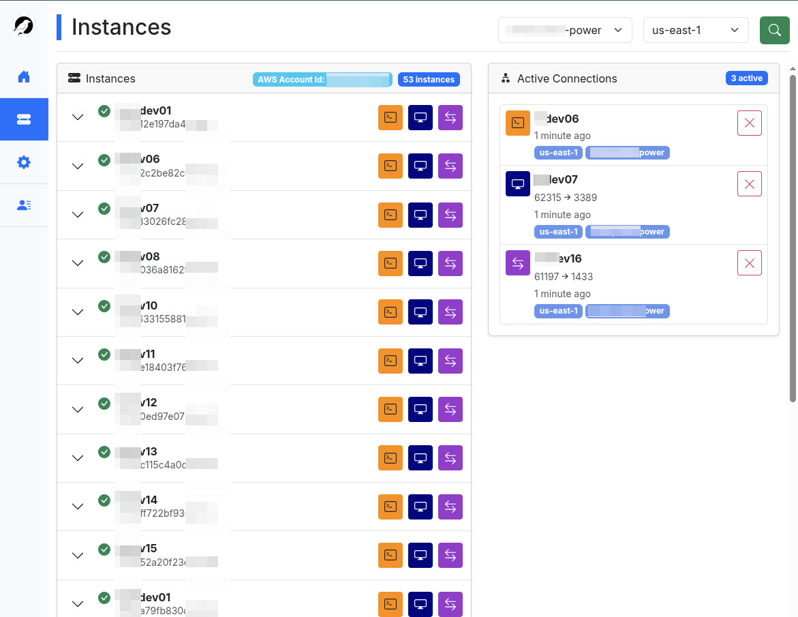

# SSM Manager (AWS)
A desktop application for managing SSM session on AWS cloud with a user-friendly GUI interface.



  - [Description](#description)
  - [Features](#features)
    - [Core Functionality](#core-functionality)
    - [Instance Management](#instance-management)
    - [Connection Types](#connection-types)
    - [Active Connection Management](#active-connection-management)
    - [Additional Features](#additional-features)
  - [Requirements](#Requirements)
  - [Installation](#installation)
  - [Usage](#usage)
  - [Development](#development)
    - [Requirements](#requirements)
    - [Setup Development Environment](#setup-development-environment)
    - [Building from Source](#building-from-source)
  - [Contributing](#contributing)
  - [Bug reports](#bug-reports)
  - [Acknowledgments](#acknowledgments)
  - [Support](#support)


## Description

SSM Manager is a cross-platform desktop application that provides a graphical interface for managing AWS Systems Manager sessions. It simplifies the process of connecting to EC2 instances through AWS Systems Manager by providing an intuitive interface for SSH sessions, RDP connections, custom port forwarding, and host port forwarding.

## Features

### Core Functionality
- **Profile and Region Management**
  - Easy switching between AWS profiles (including sso)
  - Region selection
  - Connection status monitoring
  - Profile preferences persistence
  - Maintain connections across multiple profiles

### Instance Management
- **Instance Listing**
  - Display of EC2 instances with SSM capability
  - Real-time instance status updates
  - Instance details (Name, ID, Type, OS, State, IP Address ecc..)

### Connection Types
- **SSH Sessions**
  - Direct SSH connection to instances
  - Session monitoring and management
  - Automatic session cleanup

- **RDP Connections**
  - Automated RDP port forwarding setup
  - Integration with Windows Remote Desktop
  - Dynamic local port allocation

- **Port Forwarding**
  - User-defined port forwarding
  - Dynamic local port assignment
  - Connection monitoring
  - Remote host connection through instances
  - Custom remote host and port configuration
  - Automatic local port management
  

### Active Connection Management
- Real-time connection status monitoring
- Active session termination
- Connection details display

### Additional Features
- Logging system with configurable levels
- Custom TPC port on local forwarding

## Requirements

- Windows 10 - 11 operating system
- AWS CLI installed and configured [[instructions here](https://docs.aws.amazon.com/cli/latest/userguide/getting-started-install.html)]
- AWS SSM Plugin for AWS CLI installed [instructions here](https://docs.aws.amazon.com/systems-manager/latest/userguide/session-manager-working-with-install-plugin.html)
- Valid AWS credentials configured or alternative install and configure Leapp [[instructions here](https://github.com/Noovolari/leapp)]

## Installation

1. Download the latest release from the releases page
2. Run the installer `setup.exe`.
3. Ensure that AWS CLI and SSM Plugin are installed.
   ```bash
   aws --version
   aws ssm start-session --version
   ```
5. Choose one of the following methods to configure AWS access:
   - **Option A**: Configure AWS CLI and log in to AWS. [**Instructions here**](https://docs.aws.amazon.com/cli/latest/userguide/getting-started-install.html)
6. Install the Session Manager plugin for AWS CLI. [**Instructions here**](https://docs.aws.amazon.com/systems-manager/latest/userguide/session-manager-working-with-install-plugin.html)
7. Launch **SSM Manager**.


## Usage

1. Launch the application
2. Select your AWS profile and region
3. Click "Connect" to view available instances
4. Use the action buttons to establish connections:
   - SSH: Direct terminal access
   - RDP: Remote desktop connection
   - PORT: Custom port forwarding

## Development

### Requirements
- Python 3.12+
- flask
- boto3
- psutil
- pythonnet
- cachelib
- pywebview
- pystray
- requirements.txt for more details

### Setup Development Environment
```bash
git clone https://github.com/napalm255/ssm-manager.git
cd ssm-manager
pipenv install -d
pipenv shell

```

### Building from Source

#### For Linux
```bash
make clean build

```

#### For windows
```powershell
.\make.bat
```

## Contributing

Contributions are welcome! Please feel free to submit a Pull Request. For major changes, please open an issue first to discuss what you would like to change.

## Bug reports

Create an issue on GitHub, please include the following (if one of them is not applicable to the issue then it's not needed):
- The steps to reproduce the bug
- Logs file app.log
- The version of software
- Your OS & Browser including server OS
- What you were expecting to see

## Acknowledgments

- All contributors who helped improve this tool
- A bit support from AI
- Original development by [mauroo82](https://github.com/mauroo82)

## Support

If you encounter any problems or have suggestions, please open an issue in the GitHub repository.
